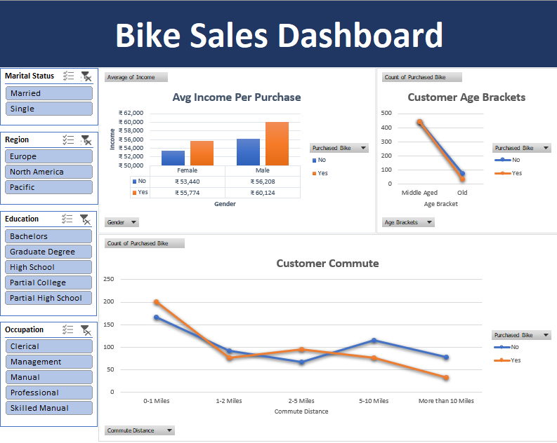
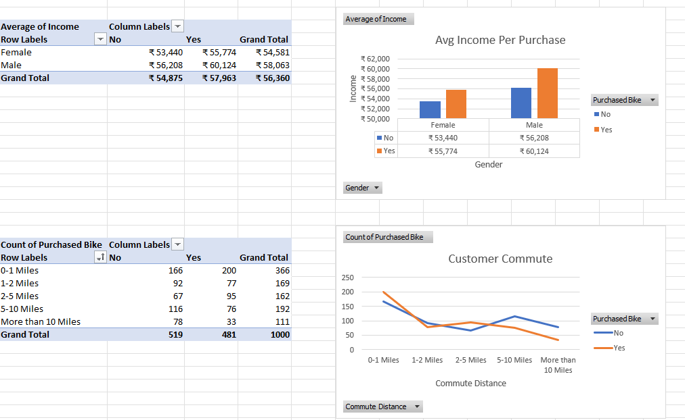

# Bike Sales Analysis Dashboard

## Overview
Developed an interactive Excel dashboard to analyze customer demographics and factors influencing bike purchases.

## Tools Used
- Microsoft Excel
- Pivot Tables
- Pivot Charts
- Slicers
- Data Cleaning
- Excel Formulas

## Analysis Performed
- Customer income analysis
- Age group analysis
- Commute distance analysis
- Gender-based purchase trends
- Regional customer insights

## Key Features
- Interactive dashboard using slicers
- Data cleaning and transformation
- Age bracket categorization using Excel formulas
- Visual representation of customer purchasing patterns

## Skills Demonstrated
Data Analysis, Data Visualization, Dashboard Development, Business Intelligence, Microsoft Excel

## Dashboard Preview

### Main Dashboard

### Pivot Tables

